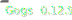
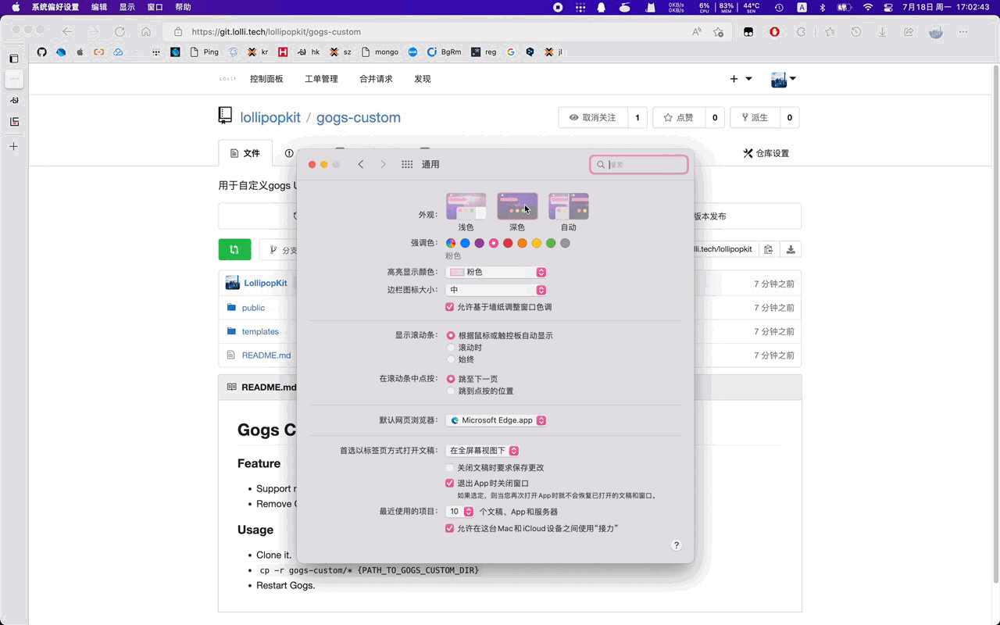

<h2>Gogs Auto Dark Mode</h2>

#### 🖥 Preview

#### 📋 Usage
1. Clone it.
2. `cp -r {CLONE_DIR}/* {PATH_TO_GOGS_CUSTOM_DIR}`
3. Restart Gogs.

#### 🔖 Feature
- Support night theme
- Remove Gogs brand

#### 📎 Advanced
- More Code Highlight Theme
    - You can found more theme in [Highlight.js](https://github.com/highlightjs/highlight.js/tree/main/src/styles).
    - Download one of them and put it in `{PATH_TO_GOGS_CUSTOM_DIR}/public/plugin/highlight-9.18.0/`
- Replace Logo  
  Use your own img to replace `public/img/favicon.png` and `public/img/gogs-hreo.png`

#### 📝 License
`LGPL LollipopKit 2022` 